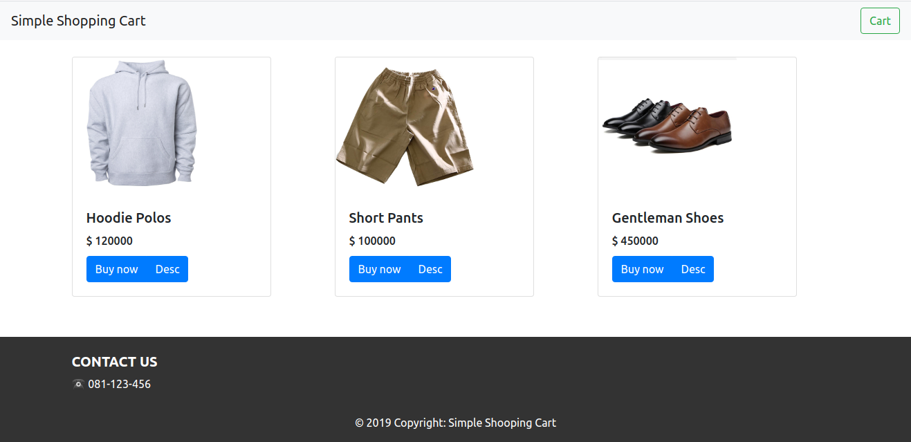

# Project Title

React Simple E-Commerce (Not Ready Yet..)


## Getting Started

These instructions will get you a copy of the project up and running on your local machine for development.

### Prerequisites

What things you need to install the software and how to install them

```
* Node.js
* CRA (Create React App)
```

### Installing

A step by step series of examples that tell you how to get a development running

Say what the step will be

```
clone the repo (https://github.com/galanggg/react-simple-ecommerce.git)
cd react-simple-ecommerce/
npm install
```

## Built With

* [Bootstrap](https://getbootstrap.com/) - The Css framework used
* [CRA](https://create-react-app.dev/) - Used to generate React App
* [Apollo GraphQL](https://www.apollographql.com/) - connect to backend GraphQL 


## Authors

* **Galang Kerta** - [galanggg](https://github.com/galanggg)

## License

This project is licensed under the MIT License - see the [LICENSE.md](LICENSE.md) file for details
